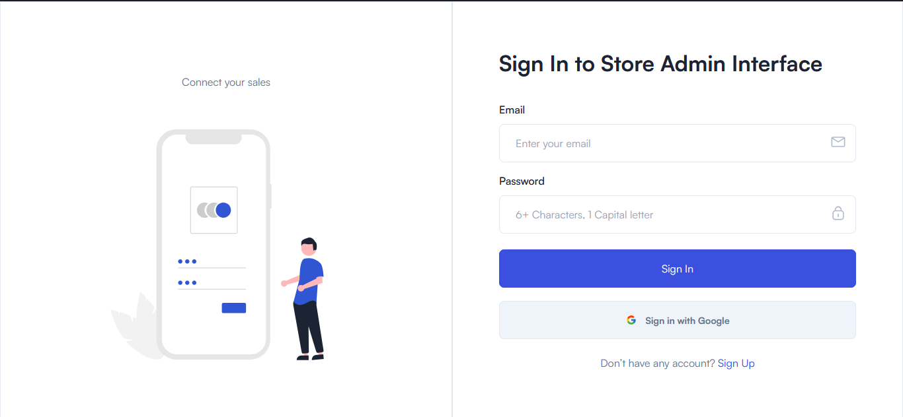

# NextJS Login Page And DataTable

This app provide a login page. It is done with:

  - Next.js
  - NextAuth
  - MongoDB
  - DataTable Prime
  - Typescript
  - Tailwind 
  - Hooks
  - React

The final version can be found here: https://next-next-auth-datatable-prime-data-table-customer.vercel.app

<p align="center">
    <a target="_blank" href="https://next-next-auth-datatable-prime-data-table-customer.vercel.app">
      
    </a>
</p>

## Instalation

**You need to install [Node.js](https://nodejs.org/en/download/)**

```git clone https://github.com/JoseHermosillo/Next-NextAuth-DatatablePrime-DataTableCustome.git```

SSH URLs provide access to a Git repository via SSH, a secure protocol. If you have a SSH key registered in your Github account, clone the project using this command:

```git clone git@github.com:JoseHermosillo/Next-NextAuth-DatatablePrime-DataTableCustome.git```

### Install dependencies

After clone, install the dependencies and devDependencies.

```sh
$ cd Next-NextAuth-DatatablePrime-DataTableCustome
$ npm install
```

Run the following command in order to start the application in a development environment:

```npm run dev```

Now you can access http://localhost:3000/ to see the login page.

## Usage

You can use the following user to make login at the app:

```
signUp
```